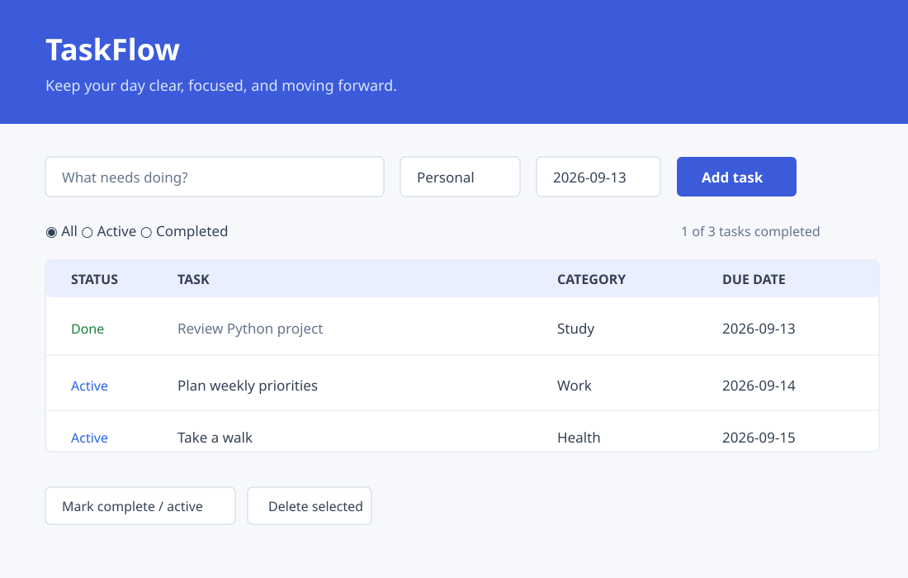

# TaskFlow — Python To-Do List

A clean, dependency-free desktop task manager built with Python and Tkinter.



> The preview illustrates the included interface. Run the app locally to see the native Tkinter window.

## Features

- Create tasks with a category and due date
- Track active and completed tasks
- Filter tasks by status
- Toggle completion, delete selected tasks, or clear completed work
- Saves tasks automatically in a local `tasks.json` file

## Run it

1. Install Python 3.10+ (Tkinter is included in most standard Python installations).
2. Clone this repository and open a terminal in the project folder.
3. Run `python app.py`.

## Project structure

```text
todo-list-python/
├── app.py                 # Application source
├── requirements.txt       # No external packages needed
├── screenshots/
│   └── taskflow-preview.svg # UI preview
├── .gitignore
└── README.md
```

## How it works

Tasks are represented as small data objects and saved as JSON beside the app. The UI refreshes after every change, so the task list and progress count stay current.

## Ideas to extend it

- Add task priorities and color labels
- Add search and sort controls
- Add reminders or recurring tasks
- Package it as an executable with PyInstaller
